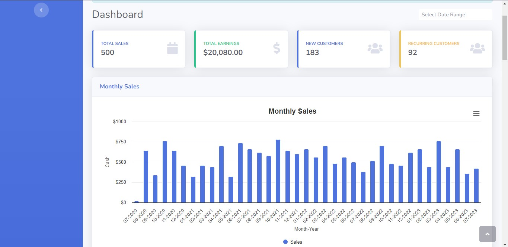

## Laravel sales-dashboard update using laravel 10
A sales dashboard demo developed by @wmushtaq and updated and tweaked to laravel 10 by @3mpj

## Updates
Fideloper proxy package removed, because laravel now has trusted proxies shipping with it.

Minor code changes and tweaks.

## Installation

1. Extract the archive and put it in the folder you want

2. Prepare your .env file there with database connection and other settings

3. Run "composer install" command

4. Run "php artisan migrate --seed" command.

5. Run "copy .env.example .env" to generate a new .env file.

6. Run "php artisan key:generate" to generate new application Key.

7. Run "php artisan serve" command.

## Features

- **Dashboard Overview**: The dashboard provides an overview of key sales metrics such as total monthly sales, earnings, customers or you can specify the time frame.
- **Reports**: The dashboard offers various reports, such as sales report, top-selling products, and revenue by category. These reports provide valuable insights for decision-making.

## License

The Laravel framework is open-sourced software licensed under the [MIT license](https://opensource.org/licenses/MIT).

## Screenshot

